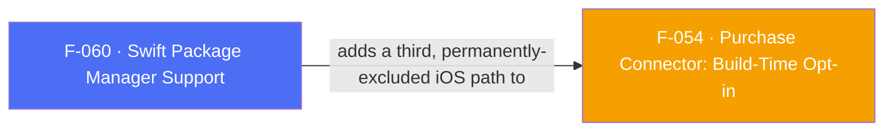

## Business Purpose
Flutter 3.44+ makes Swift Package Manager the default iOS integration mechanism, and CocoaPods trunk goes read-only on December 2, 2026 — after that date, this plugin could no longer publish new CocoaPods releases at all, and any app on Flutter 3.44+ that hadn't migrated would hit a hard build error instead of today's build warning. Without this feature, every consumer of the plugin would eventually be forced onto an unsupported distribution path, and competing attribution SDKs (Adjust, Singular) that already support SPM would have a real integration advantage. This feature adds a `Package.swift` manifest for the Core integration so apps can adopt SPM today, while leaving CocoaPods fully intact for apps that aren't ready to migrate or that need Purchase Connector (see Known Limitations).

Ticket: DELIVERY-125462.

---

## Trigger
Not a runtime trigger — this is a build-time/distribution-mechanism choice made once per consuming app project:
- **SPM path**: the app either runs on Flutter 3.44+ (SPM is the default) or explicitly opts in on earlier 3.24+ versions via `flutter config --enable-swift-package-manager`. Flutter's own tooling then discovers `ios/appsflyer_sdk/Package.swift` at its conventional path — no marker or flag is required in the podspec to signal SPM availability.
- **CocoaPods path**: unchanged — apps that run `pod install` continue to resolve via `ios/appsflyer_sdk.podspec` exactly as before.

---

## Call Chain
This feature has no runtime call chain — it is a build-time source-tree and manifest change:

```
Shared source tree (used by both paths, single copy — no duplication):
  ios/appsflyer_sdk/Sources/appsflyer_sdk/
    AppsflyerSdkPlugin.m            (RPC bridge entry point)
    AppsFlyerAttribution.m
    include/appsflyer_sdk/
      AppsflyerSdkPlugin.h          (public header, pluginClass entry point)
      AppsFlyerAttribution.h

SPM path (resolved by `flutter build`/`swift build` at build configuration time):
  ios/appsflyer_sdk/Package.swift  (swift-tools-version:5.9, platforms: [.iOS("13.0")])
    → binaryTarget "AppsFlyerRPC" — the RPC xcframework vendored directly by release URL + SHA-256
        (AppsFlyerRPC 7.0.12); upstream tag 7.0.12 Package.swift is broken (7.0.1 asset / stale
        checksum); fix exists on main (51f87d65) but no corrected tag (e.g. 7.0.13) yet
    → dependency on AppsFlyerFramework, pinned exactly to 7.0.1 (AppsFlyerRPC 7.0.12 requires it)
    → target "appsflyer_sdk" depends on FlutterFramework, AppsFlyerLib (from AppsFlyerFramework), and AppsFlyerRPC
    → compiles the shared Sources/ tree above, iOS 13.0 minimum
    → does NOT reference ios/PurchaseConnector/ — no PurchaseConnector target/product exists in this manifest

CocoaPods path (resolved by `pod install` at install time):
  ios/appsflyer_sdk.podspec
    subspec 'Core' → source_files/public_header_files point at the shared Sources/ tree; depends on AppsFlyerRPC 7.0.12
    subspec 'PurchaseConnector' → depends on PurchaseConnector 7.0.1, still points at ios/PurchaseConnector/
```

---

## Files
| File | Role |
|------|------|
| `ios/appsflyer_sdk/Package.swift` | SPM manifest. `swift-tools-version:5.9` (Xcode 15.0+), `platforms: [.iOS("13.0")]`. Vendors `AppsFlyerRPC` 7.0.12 as a `binaryTarget` (release URL + SHA-256 `14484bce…`) because upstream tag `7.0.12` Package.swift still references the 7.0.1 asset with checksum `da3223c…` (tag commit [`80eb4e21`](https://github.com/AppsFlyerSDK/appsflyer-apple-rpc/commit/80eb4e21dacfb1fa40f02db579c4731abb7db5ed)); the fix is on `main` ([`51f87d65`](https://github.com/AppsFlyerSDK/appsflyer-apple-rpc/commit/51f87d652e1e0d609871317e15dc7f6c2fd08694)) but not yet re-tagged. Depends on `AppsFlyerFramework` `.exact("7.0.1")` for `AppsFlyerLib`, plus the generated `FlutterFramework` package. |
| `ios/appsflyer_sdk/Sources/appsflyer_sdk/*.m` | Core implementation files (`AppsflyerSdkPlugin.m`, `AppsFlyerAttribution.m`) — the single shared source tree for both CocoaPods and SPM. |
| `ios/appsflyer_sdk/Sources/appsflyer_sdk/include/appsflyer_sdk/*.h` | Public headers — `AppsflyerSdkPlugin.h` is where `pluginClass: AppsflyerSdkPlugin` (declared in `pubspec.yaml`) resolves from in both integration paths. |
| `ios/appsflyer_sdk.podspec` | `Core` subspec depends on `AppsFlyerRPC 7.0.12` (which transitively pins `AppsFlyerFramework 7.0.1`); `PurchaseConnector` subspec depends on `PurchaseConnector 7.0.1`. No marker declares SPM availability — Flutter's tooling detects it purely by the presence of `Package.swift` at the conventional path. |
| `ios/.gitignore` | `.build/` and `.swiftpm/` — local SPM resolution/build artifacts that must not be committed. |
| `CHANGELOG.md` | Documents SPM support, Purchase Connector's continued CocoaPods-only status, and a link to flutter/flutter#161182. |

---

## Input / Output
| | |
|--|--|
| **Input** | Which iOS integration mechanism the consuming app's Flutter tooling selects: SPM (default on Flutter 3.44+, opt-in via `flutter config --enable-swift-package-manager` on 3.24–3.43) or CocoaPods (`pod install`, unchanged). Nothing in `pubspec.yaml` changes to select this — it's entirely driven by the app's own Flutter/Xcode configuration. |
| **Output** | Which build system compiles the Core native code and links `AppsFlyerFramework` into the app: Swift Package Manager resolving `AppsFlyerLib` directly from GitHub, or CocoaPods resolving the `AppsFlyerFramework` pod as before. Either path produces the same compiled Core behavior — same source files, same public API surface. |

---

## Tests
No dedicated automated unit test — this is a build-configuration/distribution-mechanism concern with no Dart or native runtime logic change, the same category as F-054 (Purchase Connector: Build-Time Opt-in), which sets the precedent that this class of change is verified via full builds rather than unit tests.

**Automated CI (CocoaPods path only):** `.github/workflows/lint-test-build.yml` builds the iOS example app via `pod install` on every PR/push and RC release; `.github/workflows/ios-e2e.yml` runs the `.af-e2e/test-plan.json` scenario suite on a simulator after `pod install` (weekly cron + RC gate + manual `workflow_dispatch`). Neither workflow toggles Flutter SPM — they exercise the CocoaPods integration path only. Recent green runs: [Lint, Test & Build — Release 6.18.1](https://github.com/AppsFlyerSDK/appsflyer-flutter-plugin/actions/runs/30246866162), [iOS E2E — weekly master](https://github.com/AppsFlyerSDK/appsflyer-flutter-plugin/actions/runs/30185600580).

**Local / manual verification (7.0.x SPM migration):** the SDK 7 RPC migration updated `Package.swift` to vendor **AppsFlyerRPC 7.0.12** (→ AppsFlyerFramework 7.0.1) and raised the deployment target to iOS 13.0. There is no dedicated CI matrix that toggles SPM today; the following were verified locally against the current tree:

| Configuration | How verified | Status |
|---------------|--------------|--------|
| **SPM, Core only** (recommended) | `swift package describe` in `ios/appsflyer_sdk/` confirms `AppsFlyerLib` at `Exact: 7.0.1` + vendored `AppsFlyerRPC` 7.0.12 binaryTarget; `flutter build ios --simulator` with `flutter config --enable-swift-package-manager` and `example/pubspec.yaml` SPM enabled | Verified locally for 7.0.x |
| **CocoaPods, Core only** | `pod spec lint --quick --allow-warnings`; CI Lint/Test/Build + iOS E2E (above) | Covered by CI |
| **CocoaPods, Core + PurchaseConnector** | Example app with `$AppsFlyerPurchaseConnector = true`; ad-hoc iOS E2E on throwaway branch ([run 29848672331](https://github.com/AppsFlyerSDK/appsflyer-flutter-plugin/actions/runs/29848672331), DELIVERY-125462 era, CocoaPods-only) | Verified for 6.18.x; re-run before 7.0.0 RC |
| **SPM + PurchaseConnector** | Not supported — see Known Limitations | Explicitly not tested/recommended |

Also verified for every release: `flutter test test` (Dart suite unaffected by iOS build-manifest changes).

> **Gap:** a permanent CI job that builds with `flutter config --enable-swift-package-manager` (SPM Core path) on the 7.0.x line is not yet wired. Before shipping 7.0.0 RC, manually run the SPM Core-only row above and attach the run to the release checklist.

---

## Known Limitations
- **Purchase Connector is not available via SPM this release, with no opt-in mechanism at all.** `Package.swift` never references `ios/PurchaseConnector/` and has no equivalent of the podspec's `pod_target_xcconfig` macro injection, so `ENABLE_PURCHASE_CONNECTOR` is never defined for an SPM build under any configuration. Calling a Purchase Connector Dart API from an SPM-only integration fails with the same generic Flutter `MissingPluginException` that F-054 already documents for the CocoaPods not-opted-in case — this is not a new or worse failure mode, but it is a third, permanent path to it (not something a developer can fix by setting a flag, unlike the other two paths). Apps that need Purchase Connector must stay on CocoaPods until flutter/flutter#161182 is resolved.
- **SPM and Purchase Connector cannot be combined.** An app can set `$AppsFlyerPurchaseConnector = true` in its Podfile while also having SPM enabled — this may build without duplicate-symbol errors, but Flutter's tooling can silently drop the CocoaPods `PurchaseConnector` pod once it detects the plugin has a `Package.swift`, meaning the feature may not be present despite looking configured. This combination is explicitly documented as unsupported (`doc/installation-guide.md`, `doc/purchase-connector.md`): **apps using Purchase Connector must not enable SPM for this plugin at all.**
- **flutter/flutter#161182 (Flutter's own plugin tooling lacking conditional-compilation support under SPM) is the real blocker**, not a SwiftPM limitation — investigated during research (`internal-docs/researches/R-001-spm-support.md`), including whether SwiftPM Package Traits (Swift tools 6.1+) could work around it. They cannot: the issue's own text states Flutter would need to add trait support to its plugin tooling first, which it has not.
- **Three architectural alternatives to bring Purchase Connector onto SPM were evaluated and rejected for this release** (see `internal-docs/researches/R-001-spm-support.md` addendum): a second product in the same `Package.swift` (not viable — Flutter's tooling only links one product per plugin, no documented support for a second), an environment-variable-gated compile flag (technically usable but fragile — requires every consuming app to set an env var on every build/CI run with silent failure if forgotten), and splitting Purchase Connector into its own federated pub.dev package (architecturally sound, no hidden blocker, but a separate, larger initiative with its own versioning/release pipeline — a candidate future initiative, not part of this ticket).

---

## Dependencies

